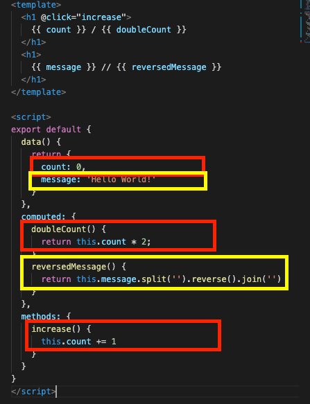

# Composition API

## 개요 - 왜 컴포지션 API가 필요한가

지금껏 컴포넌트를 vue.js로 컴포넌트를 제작하면서 재사용 가능한 코드들로 결합되어진 인터페이스들을 반복 가능하도록 하였다. 이것만으로도 충분히 유지관리성과 유연성을 얻을 수 있었다. 하지만 프로젝트가 아주 커지면서 컴포넌트 또한 아주 많아진다면 여전히 유지관리가 어렵다.

아래의 코드는 'count' 와 'message' 논리를 다루는 컴포넌트이다.

```html
<template>
  <h1 @click="increase">{{ count }} / {{ doubleCount }}</h1>
  <h1>{{ message }} // {{ reversedMessage }}</h1>
</template>

<script>
  export default {
    data() {
      return {
        count: 0,
        message: "Hello World!",
      };
    },
    computed: {
      doubleCount() {
        return this.count * 2;
      },
      reversedMessage() {
        return this.message.split("").reverse().join("");
      },
    },
    methods: {
      increase() {
        this.count += 1;
      },
    },
  };
</script>
```

아주 간단한 코드이지만 count와 message를 구성하는 논리 조각들이 따로 흩뿌려져 있다.


빨간 부분이 'count'와 관련된 조각, 노란 부분이 'message'와 관련된 조각이다.

지금은 아주 짧은 코드이어서 코드를 읽는데에 큰 문제가 없을 수 있다. 하지만 컴포넌트가 아주 커진다면 문제가 생길 것이다.


[컴포지션 API가 필요한 이유](https://v3.ko.vuejs.org/guide/composition-api-introduction.html#%E1%84%8F%E1%85%A5%E1%86%B7%E1%84%91%E1%85%A9%E1%84%8C%E1%85%B5%E1%84%89%E1%85%A7%E1%86%AB-api%E1%84%80%E1%85%A1-%E1%84%91%E1%85%B5%E1%86%AF%E1%84%8B%E1%85%AD%E1%84%92%E1%85%A1%E1%86%AB-%E1%84%8B%E1%85%B5%E1%84%8B%E1%85%B2)

`data`, `computed`, `methods` 등으로 옵션을 분리하는 것은 근본적인 논리적 관심사를 애매하게 만든다. 또한, 하나의 논리에 대해 작업을 할 때, 관련 코드의 옵션 블록을 지속적으로 '점프'해야 하는 불편함이 있다. 이를 개선하기 위해 Composition API 개념을 도입한다.

<br/>

## 반응형 데이터 (반응성)

우리는 아래의 코드에서 h1 태그를 클릭하면 `this.count`가 1씩 증가하면서 동시에 화면에 변경된 값이 출력됨을 알고 있고, 이를 '반응성'이라 하였다.

```html
<template>
  <h1 @click="increase">{{ count }}</h1>
</template>

<script>
  export default {
    data() {
      return {
        count: 0,
      };
    },
    methods: {
      increase() {
        this.count += 1;
      },
    },
  };
</script>
```

우선 위 코드를 Composition의 형태로 수정해본다. `setup()` 옵션을 활성화하고 내부에 count 변수와 increase 메서드를 구현하고 반환(return)해준다. data와 methods 옵션은 더 이상 필요 없으므로 삭제한다.

```html
<template>
  <h1 @click="increase">{{ count }}</h1>
</template>

<script>
  export default {
    setup() {
      let count = 0;
      function increase() {
        count += 1;
      }

      return {
        count,
        increase,
      };
    },
  };
</script>
```

- 화면에 출력된 숫자를 클릭하더라도 아무런 변화가 없다.
- 기본적으로 Composition API에서 활용된 변수는 반응성을 가지지 못하기 때문이다.

반응성을 구현하기 위해 `ref` 라는 기능을 활용한다.<br/>

```html
<template>
  <h1 @click="increase">{{ count }}</h1>
</template>

<script>
  import { ref } from "vue";
  export default {
    setup() {
      let count = ref(0);
      function increase() {
        count.value += 1;
      }

      return {
        count,
        increase,
      };
    },
  };
</script>
```

- vue 패키지로 부터 객체 구조 분해로 'ref'를 가져왔다
- count를 ref를 이용하여 0으로 초기화해주었다.
- 주의1) ref 로 초기화 된 변수는 지정한 초기값이 아닌 ref 객체이다.

```bash
RefImpl {_shallow: false, __v_isRef: true, _rawValue: 0, _value: 0}
__v_isRef: true
_rawValue: 0
_shallow: false
_value: 0
value: (...)
__proto__: Object
```

`count` 를 출력하였을 때 위와 같은 ref 객체가 출력됨을 알 수 있다.

- 주의2) ref 로 선언된 변수의 값은 `setup()` 내부에서는 value 속성을 변경하여야 한다.
- 주의3) 반환된 count는 template 내부에서는 더 이상 value 속성을 사용하지 않아도 된다.

<br/>

## Computed 옵션

```javascript
computed: {
  doubleCount() {
    return this.count * 2
  },
  reversedMessage() {
    return this.message.split('').reverse().join('')
  }
},
```

위 코드는 아래와 같이 Composition API 형식으로 수정할 수 있다.

```javascript
import { computed } from "vue";

// ...
const doubleCount = computed(() => count.value * 2);
const reversedMessage = computed(() =>
  message.value.split("").reverse().join("")
);
```

<br/>

## Watch 옵션

```javascript
watch: {
  message(newValue) {
    console.log(newValue)
  }
},

// 위 아래의 코드는 동일하게 동작한다

setup() {
  watch(message, (newValue) => console.log(newValue))
}
```

<br/>

## 라이프사이클

`mounted` 옵션을 예시로 비교

```javascript
mounted() {
  console.log(this.count);
},

// 위 아래의 코드는 동일하게 동작한다.

import { onMounted } from 'vue'
setup() {
  onMounted(() => console.log(count.value));
}
```

위와 같이 대부분의 라이프사이클 메서드들의 앞에 `on` 키워드를 붙혀 사용할 수 있다. (`onUpdated`, `onBeforeUpdate` 등...) <br/>

- 주의) `setup` 자체가 `beforeCreate`, `created` 사이에 실행된다. 즉, beforeCreate() 가 setup() 직전에 호출되고, created()가 setup() 직후에 호출되는 사이클이다.
- 따라서 created(), beforeCreate() 에 작성되는 모든 코드는 setup 함수 내부에 직접 작성하면 된다.

<br/>

## Props 와 Context

아래의 구성을 Composition API 로 활용해보고자 한다.

```html
<!-- App.vue -->
<template>
  <MyBtn class="hwoo" style="color: red;" color="#ff0000" @hello="log">
    Apple
  </MyBtn>
</template>

<script>
  import MyBtn from "~/components/MyBtn";
  export default {
    components: {
      MyBtn,
    },
    methods: {
      log() {
        console.log("Hello World!");
      },
    },
  };
</script>
```

```html
<!-- MyBtn.vue -->
<template>
  <div v-bind="$attrs" class="btn" @click="hello">
    <slot></slot>
  </div>
</template>

<script>
  export default {
    inheritAttrs: false,
    props: {
      color: {
        type: String,
        default: "gray",
      },
    },
    emits: ["hello"],
    mounted() {
      console.log(this.color);
      console.log(this.$attrs);
    },
    methods: {
      hello() {
        this.$emit("hello");
      },
    },
  };
</script>
```

- setup() 함수를 선언한다. setup 함수 내에서는 컴포넌트에 연결한 props와 상속받는 객체를 사용할 수 없으므로, 매개변수로 `props` 와 `context` 를 전달하여 사용할 수 있도록 한다.
- `props` 는 위에서 지정한 props 옵션과 연결된다.
- `context` 는 상속받는 객체들이다. 현재 코드에서는 `attrs` 에 대한 내용과 `emit` 에 대한 내용이 저장되어 있다.

setup 함수에서 context 를 출력한 결과 -

```
onSetup:
{expose: ƒ}
attrs: Proxy
emit: (event, ...args) => instance.emit(event, ...args)
expose: exposed => {…}
slots: (...)
get attrs: ƒ attrs()
get emit: emit() { return (event, ...args) => {…}
get slots: ƒ slots()
__proto__: Object
```

- mounted() 를 수정한다.
- 주의) `$attr` 을 setup 내부에서 사용할 때에는 context 의 속성으로서 호출해야하고, 이 때는 `$` (dollar sign) 을 사용하지 않는다.

```javascript
import { onMounted } from 'vue';
export default {
  inheritAttrs: false,
  props: {
    color: {
      type: String,
      default: "gray",
    },
  },
  emits: ["hello"],
  setup() {
    onMounted(() => {
      console.log(props.color)
      console.log(context.attr)
    }
  }
}
```

- methods 옵션을 옮겨 넣는다.
- emit 또한 context 의 속성으로서 호출되는 것이고 $ 를 넣지 않는다.
- hello 를 사용할 수 있도록 setup 함수에서 반환해준다.

```javascript
import { onMounted } from 'vue';
export default {
  inheritAttrs: false,
  props: {
    color: {
      type: String,
      default: "gray",
    },
  },
  emits: ["hello"],
  setup() {
    function hello() {
      context.emit('hello')
    }
    onMounted(() => {
      console.log(props.color)
      console.log(context.attr)
    }

    return {
      hello
    }
  }
}
```
